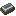
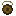

# HB's Traveler Rewards

HB’s True Rewards for Travelers adds items in your game that are fitting rewards for the relentless Adventurer. It introduces several unique items and corresponding mechanics so that you can get excited about looting again. This mod and its art - created by @Cebularz (discord) are made in a Vanilla style to fit in with lightweight Vanilla Style modpacks. The mechanics - however, are deep and fit in among heavy and highly integrated modpacks. While the unique drops of this mod are integrated into vanilla structures and mobs by default, I recommend modpack authors drop many of those configs and integrate the items where they think they belong in a specifically designed pack.

# Item Wiki

*These Structure Spawn Rates are NOT native to the mod. They are added using KubeJS and Lootr mods and the [script](https://github.com/jhw2167/MCM_004_HBs-True-Rewards-Traveler/kubejs/server_scripts/hbs_traveler_rewards_structures.js) in my github. 
You will have to download the associated mods and add the script to get the items to spawn naturally in your world. However, this also makes it extremely easy to adjust the spawn rates and structures of these items*

\*Items with an asterisk are not yet added

| Icon | Item Name | Description | Spawn Locations & Rates | Notes                                                                                                                                  |
|------|-----------|-------------|------------------------|----------------------------------------------------------------------------------------------------------------------------------------|
|  | Whetstone | Adds 1 level of Sharpness to a weapon| Village Weaponsmith 2.5% · Village Armorer 2.5% · Village Toolsmith 2.5% · Mineshaft 5% · Pillager Outpost 2.5% · Woodland Mansion 2.5% · Nether Fortress 2.5% · Bastion Other 2.5% · Bastion Bridge 2.5% · Bastion Hoglin Stable 2.5% | Cannot Exceed Sharpness V                                                                                                              |
|  | Bracing* | Adds 1 level of unbreaking to a tool, weapon, or armor | Abandoned Mineshaft 5% | Cannot exceed Unbreaking V                                                                                                             |
|  | Enchanted Essence | An Essence with varied properties depending on the Enchant applied in an Anvil | Mineshaft 10% · Desert Pyramid 10% · Jungle Temple 10% · Buried Treasure 10% · Nether Fortress 10% · Bastion Other 7.5% · Bastion Bridge 7.5% · Bastion Hoglin Stable 7.5% · Bastion Treasure 10% · Ancient City 25% · End City 25% | After Enchanting, can be used to teleport to a nearby biome corresponding to the specified Enchantment                                 |
|  | Potion Pot | Right Click to open, toss to brew a potion! | Mineshaft 10% · Simple Dungeon 10% · Desert Pyramid 7.5% · Jungle Temple 7.5% · Nether Fortress 7.5% · Bastion Other 5% · Bastion Bridge 5% · Bastion Hoglin Stable 5% |                                                                                                                                        |
|  | Diamond Shard | Repairs Diamond equipment in an Anvil | Mineshaft 2.5% · Simple Dungeon 2.5% · Nether Fortress 12.5% · Ancient City 12.5% |                                                                                                                                        |
|  | Quarter Heart | A small heart fragment. Collect more to craft a larger portion | Simple Dungeon 2.5% · Desert Pyramid 2.5% · Jungle Temple 2.5% · Buried Treasure 2.5% |                                                                                                                                        |
|  | Half Heart | Join 2 to create a Pure Heart | Desert Pyramid 1% · Jungle Temple 1% · Bastion Treasure 2.5% |                                                                                                                                        |
|  | Escape Charm | Teleports a player out of a structure or deep cave, but only when at full health | Desert Pyramid 2.5% · Jungle Temple 2.5% · Nether Fortress 2.5% · Bastion Other 2.5% · Bastion Bridge 2.5% · Bastion Hoglin Stable 2.5% · Ancient City 25% · End City 25% |                                                                                                                                        |
|  | Iron Facade Block | Recognized as an Iron Block by Beacons | Simple Dungeon 7.5% · Desert Pyramid 7.5% · Jungle Temple 7.5% |                                                                                                                                        |
|  | Gold Facade Block | Recognized as a Gold Block by Beacons | Simple Dungeon 7.5% · Desert Pyramid 7.5% · Jungle Temple 7.5% |                                                                                                                                        |
|  | Diamond Facade Block | Recognized as a Diamond Block by Beacons | Desert Pyramid 1% · Jungle Temple 1% · Ancient City 10% |                                                                                                                                        |
|  | Emerald Facade Block | Recognized as an Emerald Block by Beacons  | Desert Pyramid 0.5% · Jungle Temple 0.5% |                                                                                                                                        |
|  | Weathered Beacon | An Ancient Beacon variant which is a little weaker but can be accessed much earlier | Stronghold Library 20% · Woodland Mansion 5% |                                                                                                                                        |
|  | Empty Totem* | An unenchanted totem for keeping items safe | Pillager Outpost 7.5% · Woodland Mansion 7.5% | Placing items in its inventory prevents items with Lasting from decaying and prevents items like Enderpearls from breaking on use      |
|  | Warrior Ritual Tablet | Increases player attack speed and knockback resistance permanently | Bastion Treasure 2.5% · Ruined Portal 1% |                                                                                                                                        |
|  | Fabrication Ritual Tablet | Duplicates contents of Chest. Only certain blocks may be duplicated. | Ancient City 7.5% | The item whitelist is in the configs                                                                                                   |
|  | Soulbound Ritual Tablet | Right Click to set the current inventory slot as Soulbound | Ancient City 2.5% | Soulbound slots return their items to the player upon death. Right click with your offhand to set offhand and armor slots as Soulbound |
|  | Mob Ward | Place an item in its inventory. All mobs which drop this item will be warded. | Ancient City 7.5% | Works with modded mobs                                                                                                                 |
